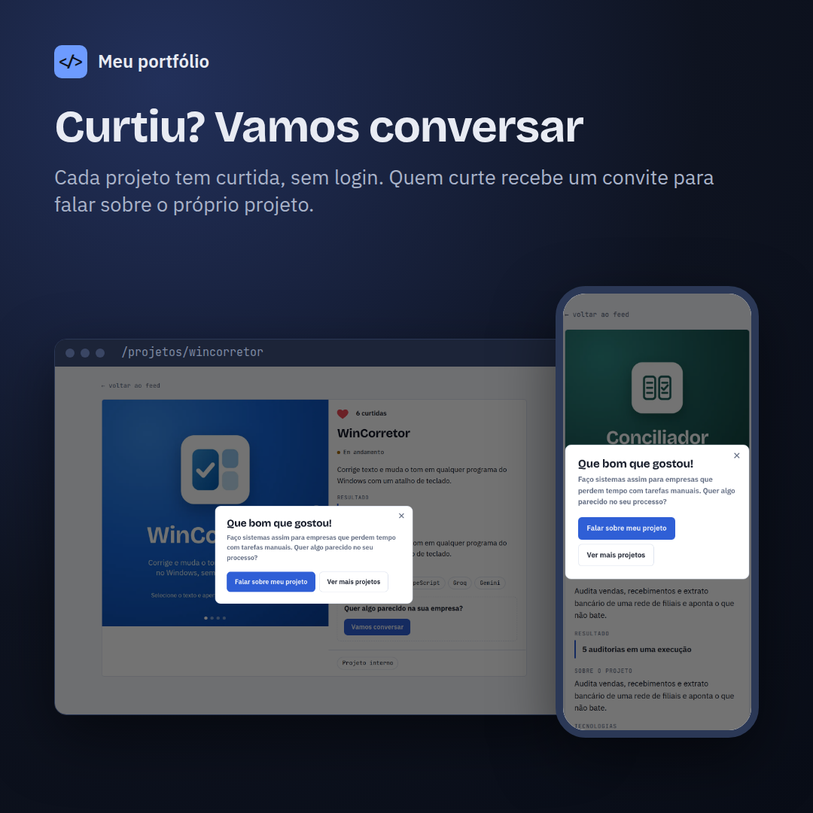
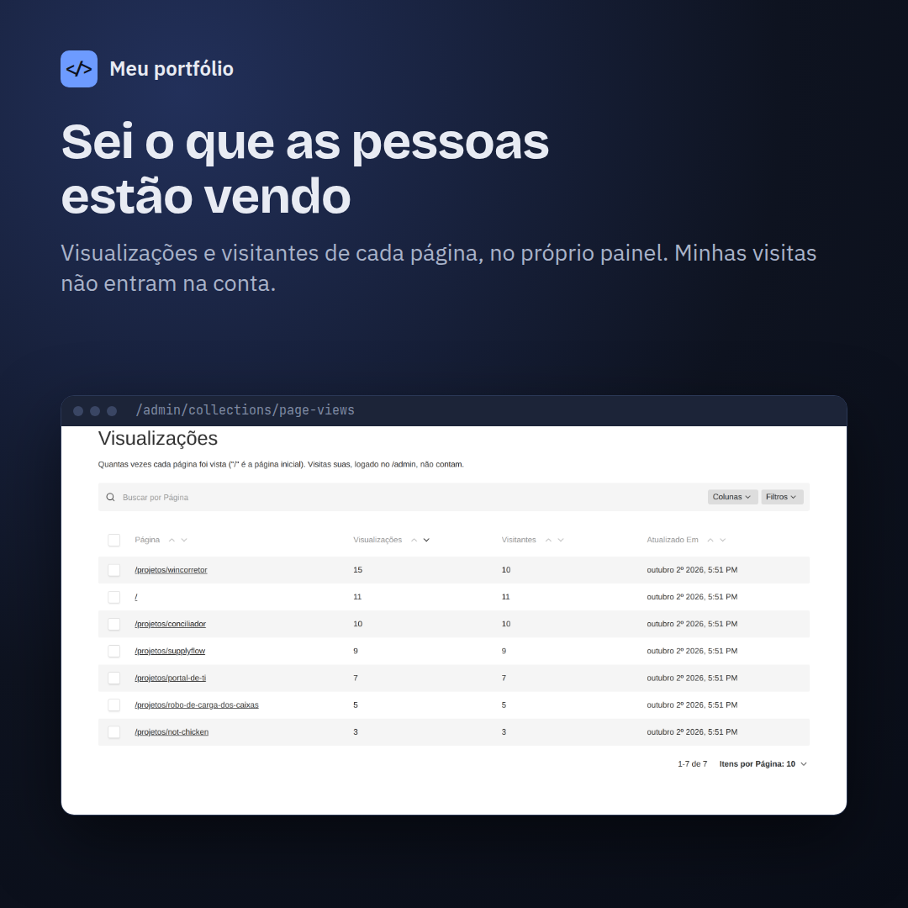
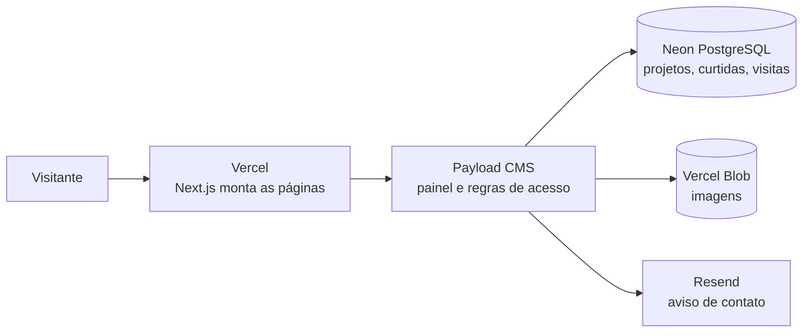

# Portfólio · Guilherme Mitter

[](https://github.com/G-Mitter/portfolio/actions/workflows/ci.yml)

**Veja no ar: [guimitter.com.br](https://guimitter.com.br)**

Meu portfólio de desenvolvedor, construído do zero. Cada projeto aparece como um post de rede social: capa, legenda e uma página com galeria, o problema resolvido e o resultado. Eu publico tudo por um painel, sem mexer no código.


## O que o site faz

- **Feed de projetos** com filtros por categoria (Automação, Web, IA, Dados) e posts fixados no topo.
- **Página de cada projeto** com galeria, resultado, tecnologias e um convite para conversar.
- **Curtidas sem login.** Quem curte recebe um convite para falar sobre o próprio projeto.
- **Formulário de contato** que salva a mensagem no painel e me avisa por e-mail, além de botões de WhatsApp e LinkedIn.
- **Painel em `/admin`** para publicar projetos, editar o perfil, as recomendações e os serviços.
- **Visualizações no próprio painel:** quantas vezes cada página foi vista e por quantos visitantes, sem ferramenta externa.
- **Pronto para buscadores:** sitemap, robots, prévia ao compartilhar no LinkedIn e no WhatsApp e página 404 em português.

| Curtida e convite | Visualizações no painel |
|---|---|
|  |  |

## Tecnologias

| Parte | Ferramenta |
|---|---|
| Site | [Next.js 16](https://nextjs.org) com React 19 e TypeScript |
| Painel e API | [Payload CMS 3](https://payloadcms.com) |
| Banco de dados | PostgreSQL no [Neon](https://neon.tech) |
| Imagens | Vercel Blob |
| E-mail | Resend |
| Hospedagem | Vercel |
| Testes | Vitest (integração) e Playwright (navegador) |

## Como funciona



- As páginas são montadas **no servidor**, buscando os dados direto do banco. O navegador recebe o HTML pronto, o que deixa o site rápido e fácil de achar no Google.
- Rascunhos só aparecem para quem está logado. Visitantes só veem projetos publicados.
- Curtidas e visualizações são gravadas por Server Actions, com validação no servidor. As curtidas também têm um limite por hora contra abuso.

## Qualidade e segurança

- Toda mudança entra por **pull request**. A CI roda lint, checagem de tipos, testes de integração e o build antes do merge.
- As migrações do banco rodam sozinhas no deploy.
- Cabeçalhos de segurança, validação de links e tipos de arquivo, e nenhuma senha ou chave no código: tudo fica nas variáveis de ambiente da Vercel.

## Estrutura do código

```
src/
├── app/(frontend)/   # Site público: feed, página do projeto, sitemap e 404
├── app/(payload)/    # Painel /admin e API, gerados pelo Payload
├── collections/      # Tabelas: projetos, imagens, mensagens, curtidas, visualizações
├── globals/          # Perfil: bio, contadores, serviços, recomendações e links
├── components/       # Partes da interface (feed, galeria, curtida, contato...)
└── lib/              # Funções pequenas e testadas (slug, links, e-mail, WhatsApp)
tests/                # Testes de integração e de navegador
```

<details>
<summary>Rodar no computador (para desenvolvimento)</summary>

Precisa de Node.js 22, pnpm 10 e um banco PostgreSQL (o Neon tem plano grátis).

```bash
pnpm install
cp .env.example .env   # preencha DATABASE_URL e PAYLOAD_SECRET
pnpm dev               # abre em http://localhost:3000
```

Outros comandos: `pnpm lint`, `pnpm typecheck`, `pnpm test:int` e `pnpm build`.
</details>

## Sobre

Desenvolvido por **Guilherme Mitter**, em Belo Horizonte, em par com IA ([Claude Code](https://claude.com/claude-code)), entendendo e revisando cada passo.

[LinkedIn](https://www.linkedin.com/in/guilherme-mitter) · [GitHub](https://github.com/G-Mitter) · [Fale comigo pelo site](https://guimitter.com.br/#contato)
